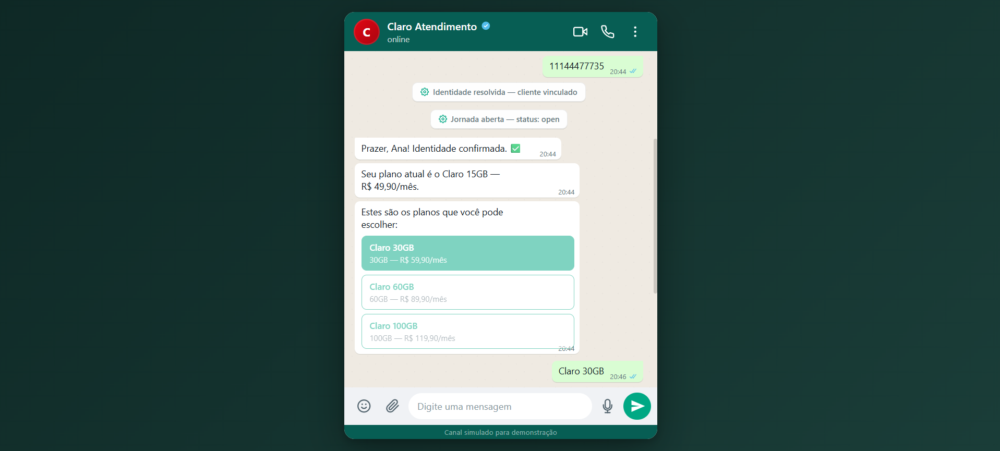
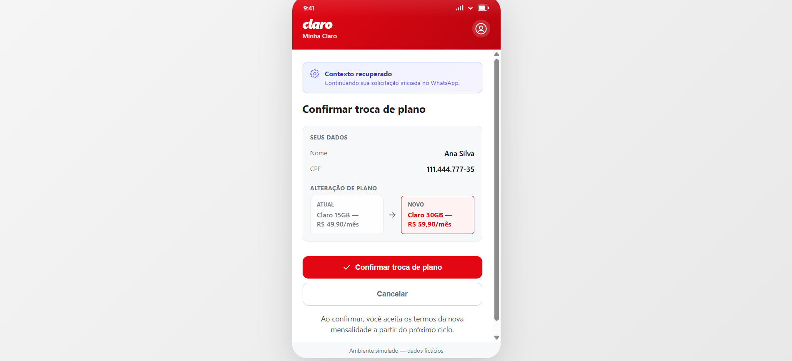
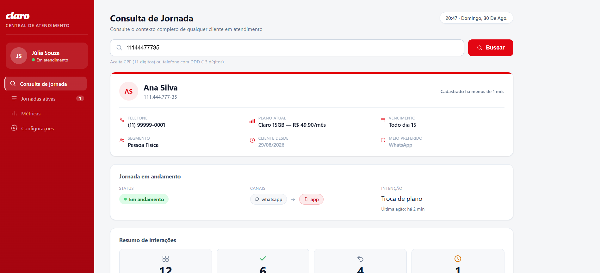

# Claro Flow Engine (CFE)

Camada de orquestração conversacional que preserva contexto de jornada entre canais de atendimento da Claro

     

Protótipo funcional desenvolvido para o Challenge FIAP × Claro 2026, pela Equipe Horizon, Turma 4SIS FIAP.

---

## Quickstart

```bash
git clone https://github.com/givasques/Challenge.ClaroFlowEngineCFE.git
cd Challenge.ClaroFlowEngineCFE
docker compose -f docker-compose.full.yml up
```

Acesse **http://localhost:5104/channels/whatsapp-sim/** para começar.

---

## Sobre o projeto

Clientes de operadoras costumam iniciar um atendimento em um canal (ex: WhatsApp) e precisar continuá-lo em outro (ex: o app oficial, ou com um atendente humano). Na maioria dos sistemas, isso significa recomeçar do zero: reinformar CPF, reexplicar o problema, refazer escolhas já feitas. O CFE existe para resolver essa descontinuidade.

A solução é uma camada de orquestração posicionada entre os canais e o backend: ela resolve a identidade unificada do cliente independentemente do identificador usado em cada canal, persiste o contexto da jornada (intenção, etapa, dados já coletados) em tempo real, e permite transferir essa jornada de um canal para outro por meio de um deep link com token, sem reintrodução de dados.

Este repositório contém um **protótipo funcional**, não um produto de produção: dados de clientes e planos são mockados (seed automático), a autenticação por canal é simulada via header, e os três canais de atendimento (chat, app, painel do atendente) são interfaces simuladas construídas para o protótipo, não integrações reais com WhatsApp Business API ou um app publicado.

---

## Integrantes: Equipe Horizon, Turma 4SIS FIAP

| Nome | RM | GitHub | LinkedIn |
|---|---|---|---|
| Caua Fernandes | 551765 | [CauaFernandess](https://github.com/CauaFernandess) | [LinkedIn](https://www.linkedin.com/in/caua-fernandes-02a877293/) |
| Gabriel Dias Santiago | 551406 | [Gabriel-Dias-Santiago](https://github.com/Gabriel-Dias-Santiago) | [LinkedIn](https://www.linkedin.com/in/gabriel-dias-santiago-/) |
| Giovanna Vasques Alexandre | 99884 | [givasques](https://github.com/givasques) | [LinkedIn](https://www.linkedin.com/in/giovanna-vasques-718b3a1a3/) |
| Rick Alves Domingues | 552438 | [riqinho](https://github.com/riqinho) | [LinkedIn](https://www.linkedin.com/in/rickalvesdomingues/) |
| Wemilli Nataly Lima de Oliveira | 552301 | [Wemilli](https://github.com/Wemilli) | [LinkedIn](https://www.linkedin.com/in/wemilli-lima-482989203/) |

---

## Screenshots

| Chat WhatsApp simulado | App Minha Claro simulado | Painel do Atendente |
|---|---|---|
|  |  |  |

---

## Arquitetura

```
┌──────────────┐   ┌──────────────┐   ┌──────────────────┐
│  Chat         │   │  App          │   │  Painel do        │
│  WhatsApp     │   │  Minha Claro  │   │  Atendente        │
│  (simulado)   │   │  (simulado)   │   │  (simulado)       │
└──────┬───────┘   └──────┬───────┘   └─────────┬─────────┘
      │                   │                      │
      │   HTTP/JSON (header X-Channel-Token)      │
      └───────────────────┼──────────────────────┘
                           ▼
            ┌────────────────────────────────────┐
            │      Claro Flow Engine API          │
            │  ┌─────────┬─────────┬───────────┐  │
            │  │Identity │ Context │ Invoices  │  │
            │  ├─────────┴─────────┴───────────┤  │
            │  │      Handoff      │   Panel   │  │
            │  └────────────────────────────────┘  │
            └────────────────┬───────────────────┘
                              ▼
                     ┌─────────────────┐
                     │   PostgreSQL 16  │
                     └─────────────────┘
```

- **Identity**: resolve a identidade unificada do cliente a partir de qualquer identificador (CPF, telefone, login).
- **Context**: mantém o ciclo de vida da jornada (abertura, atualização, expiração, encerramento) e o histórico de transições.
- **Handoff**: gera e resolve os tokens de deep link que transferem uma jornada entre canais.
- **Invoices**: expõe as faturas do cliente (com itens de linha), consumidas pelo fluxo de contestação de cobrança.
- **Panel**: dados agregados para o menu lateral do painel do atendente, cobrindo jornadas ativas em tempo real e métricas operacionais (TMA, taxa de conclusão, canal mais usado).

Os cinco módulos rodam num único processo (monolito modular); ver [Decisões arquiteturais](#decisões-arquiteturais).

---

## Modos de execução

O projeto tem 2 formas de rodar via Docker Compose:

**Modo dev** (`docker-compose.yml`) sobe apenas o Postgres. Ideal para desenvolvimento: você roda a API com `dotnet run` e os canais como estáticos, com hot reload e debug nativo do editor.

**Modo full** (`docker-compose.full.yml`) sobe tudo (Postgres, API e canais servidos pela API). Ideal para demonstração ou teste ponta a ponta com um único comando.

Os dois modos são isolados (nomes de projeto e portas de Postgres diferentes) e podem coexistir sem conflito. Os comandos exatos de cada modo estão em [Setup detalhado](#setup-detalhado) logo abaixo.

---

## Setup detalhado

### Pré-requisitos

- **Docker + Docker Compose**: obrigatório em ambos os modos abaixo.
- **.NET 10 SDK**: só necessário no modo desenvolvimento.
- **Node.js** (para `npx http-server`): só necessário no modo desenvolvimento, para servir os canais simulados.

### Modo desenvolvimento

Uso: dia a dia de código, hot reload, debug. API roda via `dotnet run` na porta **5104**; cada canal roda numa porta própria (5171/5173/5175).

```bash
docker compose up -d

cd src/ClaroFlowEngine.Api
dotnet restore
dotnet run
```

Migrations e seed rodam automaticamente. Configure antes `appsettings.Development.json` (não versionado). Swagger disponível em `http://localhost:5104/swagger` **neste modo** (habilitado só em ambiente `Development`).

Em três terminais separados, sirva os canais:

```bash
npx http-server channels/whatsapp-sim -p 5171 -c-1
npx http-server channels/minha-claro-app -p 5173 -c-1
npx http-server channels/attendant-panel -p 5175 -c-1
```

### Modo full (Docker Compose completo)

Uso: testar/demonstrar tudo funcionando do zero, sem instalar .NET/Node localmente. Sobe Postgres **e** API juntos; a própria API serve os três canais em `http://localhost:5104/channels/<canal>/`.

```bash
docker compose -f docker-compose.full.yml up --build
```

Só inicia a API depois que o Postgres está pronto (`depends_on: condition: service_healthy`). Este modo roda em ambiente `Staging` (não `Production`, para permitir migration/seed automáticos; não `Development`, então **o Swagger não fica disponível aqui**, só no modo desenvolvimento).

```bash
# derrubar mantendo os dados
docker compose -f docker-compose.full.yml down

# derrubar e apagar o volume do banco
docker compose -f docker-compose.full.yml down -v
```

Os dois arquivos declaram nomes de projeto Docker Compose explícitos (`claroflowengine-dev` e `claroflowengine-full`) e usam portas de Postgres distintas (5433 e 5434): os dois modos podem coexistir sem risco de um substituir containers do outro.

### Testes

O projeto não tem suíte de testes automatizados. Testes manuais estruturados (caminho feliz + caminhos de erro) foram executados a cada fase de desenvolvimento.

### Estrutura do repositório

```
Challenge.ClaroFlowEngineCFE/
├── docker-compose.yml        # só o Postgres, modo desenvolvimento
├── docker-compose.full.yml   # Postgres + API, modo full
├── src/
│   └── ClaroFlowEngine.Api/
│       ├── Dockerfile
│       ├── Modules/           # Identity, Context, Handoff, Invoices, Panel (feature folders)
│       ├── Data/               # entidades, migrations, seed
│       └── Common/             # middleware, erros, serviços compartilhados
├── channels/
│   ├── whatsapp-sim/          # chat simulado
│   ├── minha-claro-app/       # App simulado
│   └── attendant-panel/       # painel do atendente
└── docs/
    └── screenshots/            # prints das telas (ver acima)
```

---

## Roteiros de demonstração

Os três clientes de teste já vêm no seed automático. Com a stack rodando, abra o chat, o App e o painel em abas separadas.

### Cenário 1: Caminho feliz (Ana Silva, CPF `11144477735`) · ~2 min

1. No chat, diga algo como "quero trocar de plano".
2. Informe o CPF `11144477735` quando pedido.
3. Escolha um plano (ex: "60GB") quando o bot listar as opções.
4. Clique no botão "Continuar no App" do card que aparece.
5. No App, faça login com qualquer usuário/senha e confirme a troca.
6. Verifique no painel (buscando `11144477735`) que a jornada aparece como "Concluída".

### Cenário 2: Escalada humana (Carlos Mendes, CPF `22255588846`) · ~3 min

1. Repita os passos 1-3 do cenário 1 com o CPF `22255588846`.
2. **Não** clique no link do card.
3. Abra o painel em outra aba e busque `22255588846`: deve aparecer "Em andamento".
4. Volte ao chat, clique no link, abra o App, mas não confirme ainda.
5. Volte ao painel **sem recarregar a página**: em até 4 segundos, o histórico deve mostrar "Jornada retomada em outro canal" sozinho (polling).

### Cenário 3: Abandono e expiração (Mariana Souza, CPF `33366699957`) · ~2 min

1. Repita os passos 1-3 do cenário 1 com o CPF `33366699957`.
2. **Não** clique no link.
3. Force a expiração via SQL (ajuste o container conforme o modo usado):
   ```sql
   UPDATE journey_contexts
   SET updated_at = NOW() - INTERVAL '25 hours'
   WHERE customer_id = (SELECT id FROM customers WHERE cpf = '33366699957') AND status = 'open';
   ```
4. Clique no link do chat agora: o App deve mostrar a tela de "Sessão expirada".

### Cenário 4 (opcional): Degradação de canal · ~2 min

1. Inicie uma conversa no chat até a etapa de escolha de plano.
2. Pare o container/processo da API (`docker stop cfe-api-full` no modo full, ou `Ctrl+C` no `dotnet run` em dev).
3. Envie a escolha do plano: o chat deve avisar sobre a instabilidade, sem travar.
4. No painel (se estiver com uma jornada aberta), a mesma indisponibilidade deve aparecer como uma faixa de aviso, mantendo os últimos dados carregados visíveis.
5. Suba a API de novo e repita o envio: deve funcionar normalmente.

### Cenário 5: Contestação de cobrança (Ana Silva, CPF `11144477735`) · ~3 min

1. No chat, clique no botão "Contestar cobrança" (ou digite algo como "tem uma cobrança indevida na minha fatura").
2. Informe o CPF `11144477735` quando pedido.
3. Escolha uma das 3 últimas faturas mostradas na lista.
4. Descreva o problema livremente (ex: "tem um serviço que eu não contratei").
5. Clique no botão "Continuar no App" do card que aparece.
6. No App, faça login com qualquer usuário/senha: a fatura detalhada e sua descrição já aparecem preenchidas.
7. Marque pelo menos um item da fatura e clique "Formalizar contestação".
8. Confira o número de protocolo exibido na tela final.
9. Verifique no painel (buscando `11144477735`) que a intenção aparece como "Contestação de cobrança" e a descrição do cliente fica em destaque.

### Cenário 6: Jornadas ativas e métricas em tempo real (painel) · ~2 min

1. Repita os passos 1-3 do cenário 1 com qualquer CPF do seed, mas não conclua.
2. No painel, clique em "Jornadas ativas" no menu lateral: a jornada recém-aberta deve aparecer na tabela, com badge de canal/intenção e tempo decorrido.
3. Clique em "Métricas": os 4 cards devem mostrar valores calculados a partir do banco (não mais dados fictícios).
4. Volte para "Jornadas ativas" e aguarde ~30s: a tabela deve se atualizar sozinha (visível na aba Network do navegador).

---

## Mapeamento de requisitos

A spec funcional deste projeto organiza os requisitos como casos de uso (UC01–UC10), não como uma lista numerada de RF/RNF; a tabela abaixo segue essa mesma estrutura.

| Caso de uso | Descrição | Implementação |
|---|---|---|
| UC01 | Iniciar jornada | `POST /context/open` + máquina de estados do chat |
| UC02 | Resolver identidade unificada | `POST` / `GET /identity/resolve` |
| UC03 | Registrar novo cliente | `POST /identity/resolve` com `full_name_hint` |
| UC04 | Atualizar contexto de jornada | `PATCH /context/{id}` |
| UC05 | Gerar deep link para handoff | `POST /handoff/generate` |
| UC06 | Retomar jornada em outro canal | `GET /context/resolve?token=` |
| UC07 | Encerrar jornada | `POST /context/{id}/close` |
| UC08 | Expirar jornada por inatividade | Verificação reativa em todo acesso a uma jornada aberta (`IJourneyExpirationService`) |
| UC09 | Consultar histórico de jornada (painel) | `GET /context/customer/{id}` + `GET /context/{id}/transitions`, com polling |
| UC10 | Contestar cobrança indevida | `GET /invoices/customer/{id}` + `GET /invoices/{id}` + fluxo dedicado nos 3 canais, `intent: dispute_charge` |
| RNF003 | Operação em modo degradado quando o CFE está indisponível | Timeout + retry + banner de indisponibilidade nos 3 canais |
| N/A | Jornadas ativas em tempo real (painel) | `GET /journeys/active` |
| N/A | Métricas operacionais (painel) | `GET /metrics/summary` (TMA mediano, jornadas hoje, taxa de conclusão, canal mais usado) |
| RNF005 | Direito ao esquecimento (Art. 18 LGPD) | `POST /customers/{cpf}/right-to-be-forgotten` + tela "Meus dados" no App |

---

## Decisões arquiteturais

**Monolito modular em vez de microsserviços.** Para o protótipo, um único processo com módulos isolados (Identity, Context, Handoff, Invoices, Panel) entrega a mesma separação de responsabilidades sem o custo operacional de orquestrar múltiplos serviços, rede entre eles e deploy distribuído, desnecessário para validar a proposta de valor.

**PostgreSQL.** Suporte robusto a `JSONB` (usado para o payload flexível da jornada, que varia por intenção), maturidade, e zero custo de licenciamento: adequado tanto ao protótipo quanto a uma eventual evolução para produção.

**Chat web próprio em vez de WhatsApp Business API/Telegram.** Integrar uma API de mensageria real exigiria homologação, custos e credenciais fora do controle do time, sem agregar validação à proposta central (orquestração de contexto); um chat simulado testa exatamente a mesma lógica de backend.

**Bot baseado em máquina de estados sem NLP.** A intenção do protótipo é validar a persistência e recuperação de contexto entre canais, não construir um motor de compreensão de linguagem natural; uma heurística de palavras-chave é suficiente para conduzir os cenários de demonstração de forma previsível.

---

## Limitações conhecidas

- O bot do chat reconhece intenção por heurística de palavras-chave, não por NLP real.
- A autenticação por canal (`X-Channel-Token`) é mockada via header, não é autenticação real (JWT, OAuth2 etc.), documentado como tal no próprio código.
- O login do App é mock: aceita qualquer credencial que atenda a um formato mínimo, sem verificação contra base real.
- Não há cobertura de testes automatizados; a validação é manual e estruturada, uma fase por vez.
- A regra de expiração de jornada é reativa (verificada no momento do acesso), não um job agendado em background.
- Campos do painel do atendente como "segmento" e "vencimento" são colunas reais no banco, mas preenchidas com dado mockado via seed, sem refletir um sistema de billing real.
- A tela "Configurações" do painel é mockada (campos desabilitados): não há sistema de usuários/autenticação de atendente no CFE ainda.
- Os três canais simulados não têm build step nem framework de frontend: HTML/CSS/JS puro, sem testes de UI automatizados.

---

## Roadmap de evolução

O protótipo evoluiu além do MVP inicial. Já foram entregues:

- Interatividade do bot (botões e listas no chat WhatsApp).
- Fluxo completo de contestação de cobrança nos 3 canais.
- Enriquecimento do painel do atendente com dados agregados, timeline contextualizada e histórico de jornadas anteriores.
- Menu lateral do painel conectado a dados reais (jornadas ativas e métricas operacionais).
- Integração com VLibras do Governo Federal e melhorias básicas de acessibilidade HTML.
- Direito ao esquecimento (Art. 18 LGPD), exercível pelo cliente na área "Meus dados" do App ou pelo atendente no painel.

O [histórico de commits e PRs](https://github.com/givasques/Challenge.ClaroFlowEngineCFE/pulls?q=is%3Apr) documenta cada entrega.

### Atendimento aos RNFs do Sprint 1

- **RNF003 (disponibilidade e notificação técnica)**: Serilog e Health Checks implementados; base pronta para integração com ferramentas de monitoring (Sentry, Datadog) em produção.
- **RNF005 (LGPD)**: auditabilidade completa (toda transição de jornada registrada com origem, canal e timestamp), TTL em tokens de handoff e jornadas inativas, e logs estruturados via Serilog. Direito ao esquecimento (Art. 18 LGPD) implementado: `POST /customers/{cpf}/right-to-be-forgotten` anonimiza nome, CPF e identificadores de canal mantendo o histórico operacional (jornadas, transições) íntegro para auditoria, executável pelo cliente na área "Meus dados" do App ou pelo atendente no painel. Ampliação prevista: rotina automática de anonimização por política de retenção, e outros direitos do titular (portabilidade, correção, revogação de consentimento).
- **Acessibilidade**: VLibras e ajustes básicos de HTML semântico entregues. Cobertura completa de WCAG 2.1 AA prevista para iteração futura.

### Decisões de escopo do MVP

- **Autenticação real (RNF004)**: fora do escopo. Em produção seria provida pelos canais Claro existentes (login do App Minha Claro, WhatsApp Business). O `X-Channel-Token` é identificação simplificada entre serviços do protótipo.
- **Stack do painel**: HTML/CSS/JS puro em vez de React (previsto no Sprint 1), o que simplificou o deployment e reduziu o tempo de MVP. Reescrita em framework moderno pode ser priorizada se o volume de funcionalidades justificar.

### Evoluções futuras possíveis

Sem compromisso de prazo; dependem de uma eventual evolução do protótipo para produto:

- Novos canais (Alexa, RCS, SMS, USSD, totem).
- Novas intenções (2ª via, portabilidade, cancelamento, agendamento técnico).
- Extração dos módulos internos para microsserviços independentes, se a escala justificar.
- Sistema de usuários/autenticação para atendentes, habilitando a tela de Configurações do painel a deixar de ser mockada.
- Integração real com WhatsApp Business API.

---

## Licença

Projeto acadêmico desenvolvido para o Challenge FIAP × Claro 2026. Todos os dados são fictícios; nomes de produtos são referências acadêmicas.
