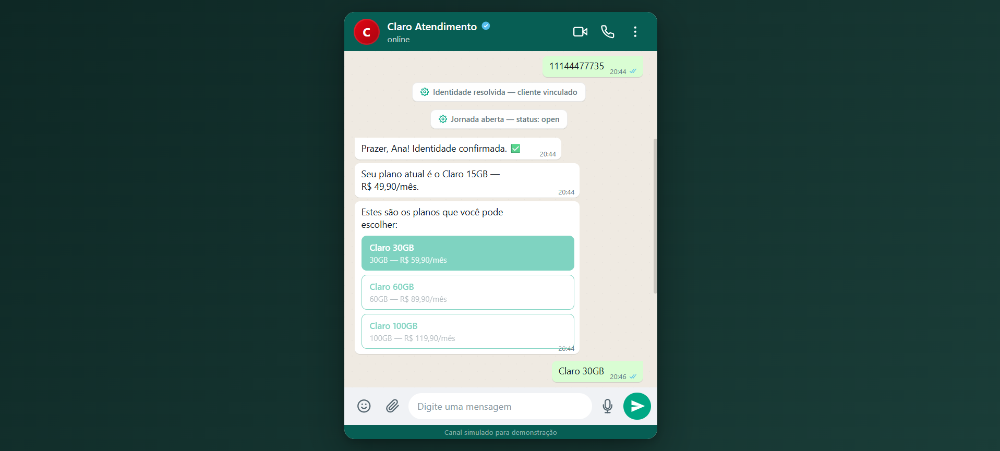
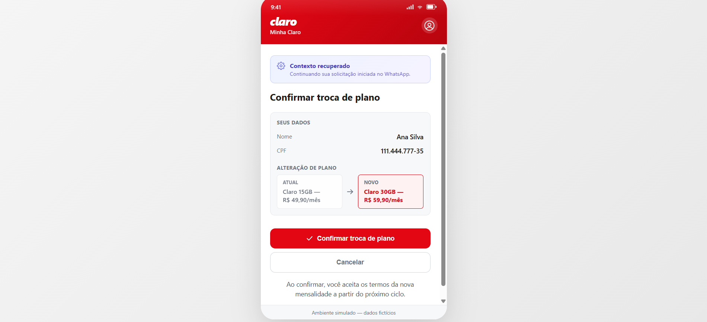
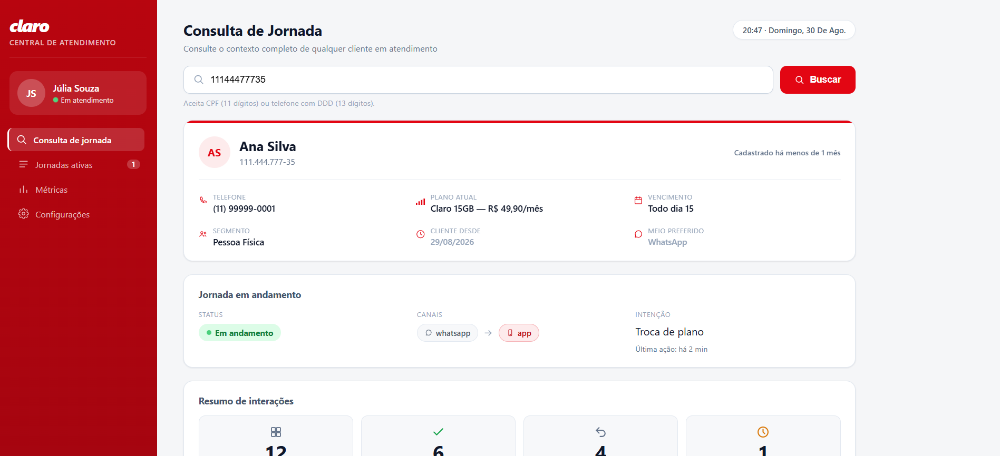

# Claro Flow Engine (CFE)

Camada de orquestração conversacional que preserva contexto de jornada entre canais de atendimento da Claro

     

Protótipo funcional desenvolvido para o Challenge FIAP × Claro 2026, pela Equipe Horizon, Turma 4SIS FIAP.

---

## Quickstart

```bash
git clone https://github.com/givasques/Challenge.ClaroFlowEngineCFE.git
cd Challenge.ClaroFlowEngineCFE
docker compose -f docker-compose.full.yml up
```

Acesse **http://localhost:5104/channels/whatsapp-sim/** para começar.

---

## Sobre o projeto

Clientes de operadoras costumam iniciar um atendimento em um canal (ex: WhatsApp) e precisar continuá-lo em outro (ex: o app oficial, ou com um atendente humano). Na maioria dos sistemas, isso significa recomeçar do zero: reinformar CPF, reexplicar o problema, refazer escolhas já feitas. O CFE existe para resolver essa descontinuidade.

A solução é uma camada de orquestração posicionada entre os canais e o backend: ela resolve a identidade unificada do cliente independentemente do identificador usado em cada canal, persiste o contexto da jornada (intenção, etapa, dados já coletados) em tempo real, e permite transferir essa jornada de um canal para outro por meio de um deep link com token, sem reintrodução de dados.

Além disso, o CFE inclui um módulo de inteligência operacional: os próprios dados de jornadas são analisados para gerar oportunidades comerciais acionáveis, transformando o sistema de orquestração em uma fonte contínua de insights para atendimento e vendas.

Este repositório contém um **protótipo funcional**, não um produto de produção: dados de clientes e planos são mockados (seed automático), a autenticação por canal é simulada via header, e os três canais de atendimento (chat, app, painel do atendente) são interfaces simuladas construídas para o protótipo, não integrações reais com WhatsApp Business API ou um app publicado.

---

## Integrantes: Equipe Horizon, Turma 4SIS FIAP

| Nome | RM | GitHub | LinkedIn |
|---|---|---|---|
| Caua Fernandes | 551765 | [CauaFernandess](https://github.com/CauaFernandess) | [LinkedIn](https://www.linkedin.com/in/caua-fernandes-02a877293/) |
| Gabriel Dias Santiago | 551406 | [Gabriel-Dias-Santiago](https://github.com/Gabriel-Dias-Santiago) | [LinkedIn](https://www.linkedin.com/in/gabriel-dias-santiago-/) |
| Giovanna Vasques Alexandre | 99884 | [givasques](https://github.com/givasques) | [LinkedIn](https://www.linkedin.com/in/giovanna-vasques-718b3a1a3/) |
| Rick Alves Domingues | 552438 | [riqinho](https://github.com/riqinho) | [LinkedIn](https://www.linkedin.com/in/rickalvesdomingues/) |
| Wemilli Nataly Lima de Oliveira | 552301 | [Wemilli](https://github.com/Wemilli) | [LinkedIn](https://www.linkedin.com/in/wemilli-lima-482989203/) |

---

## Screenshots

| Chat WhatsApp simulado | App Minha Claro simulado | Painel do Atendente |
|---|---|---|
|  |  |  |

---

## Arquitetura

```
┌──────────────┐   ┌──────────────┐   ┌──────────────────┐
│  Chat         │   │  App          │   │  Painel do        │
│  WhatsApp     │   │  Minha Claro  │   │  Atendente        │
│  (simulado)   │   │  (simulado)   │   │  (simulado)       │
└──────┬───────┘   └──────┬───────┘   └─────────┬─────────┘
      │                   │                      │
      │   HTTP/JSON (header X-Channel-Token)      │
      └───────────────────┼──────────────────────┘
                           ▼
            ┌────────────────────────────────────┐
            │      Claro Flow Engine API          │
            │  ┌─────────┬─────────┬───────────┐  │
            │  │Identity │ Context │ Invoices  │  │
            │  ├─────────┴─────────┴───────────┤  │
            │  │      Handoff      │   Panel   │  │
            │  └────────────────────────────────┘  │
            └────────────────┬───────────────────┘
                              ▼
                     ┌─────────────────┐
                     │   PostgreSQL 16  │
                     └─────────────────┘
```

- **Identity**: resolve a identidade unificada do cliente a partir de qualquer identificador (CPF, telefone, login).
- **Context**: mantém o ciclo de vida da jornada (abertura, atualização, expiração, encerramento) e o histórico de transições.
- **Handoff**: gera e resolve os tokens de deep link que transferem uma jornada entre canais.
- **Invoices**: expõe as faturas do cliente (com itens de linha), consumidas pelo fluxo de contestação de cobrança.
- **Panel**: dados agregados para o menu lateral do painel do atendente, cobrindo jornadas ativas em tempo real e métricas operacionais (TMA, taxa de conclusão, canal mais usado).

Os cinco módulos rodam num único processo (monolito modular); ver [Decisões arquiteturais](#decisões-arquiteturais).

---

## Modos de execução

O projeto tem 2 formas de rodar via Docker Compose:

**Modo dev** (`docker-compose.yml`) sobe apenas o Postgres. Ideal para desenvolvimento: você roda a API com `dotnet run` e os canais como estáticos, com hot reload e debug nativo do editor.

**Modo full** (`docker-compose.full.yml`) sobe tudo (Postgres, API e canais servidos pela API). Ideal para demonstração ou teste ponta a ponta com um único comando.

**Cenário da Central operacional:** o seed cria 5 clientes de demonstração com jornadas abertas em níveis diferentes de inatividade (2 de atenção, 2 críticas e 1 normal). Os horários são relativos ao momento em que o banco é criado: com o tempo, os níveis mudam (por exemplo, uma jornada de 8 min vira crítica depois de cerca de 15 min). Para ver o cenário com os horários de agora, recrie o banco com `docker compose -f docker-compose.full.yml -p claroflowengine-full down -v` seguido de `up -d --build`. Reiniciar só a API não recria o cenário: o seed é idempotente e não duplica nada.

Os dois modos são isolados (nomes de projeto e portas de Postgres diferentes) e podem coexistir sem conflito. Os comandos exatos de cada modo estão em [Setup detalhado](#setup-detalhado) logo abaixo.

---

## Setup detalhado

### Pré-requisitos

- **Docker + Docker Compose**: obrigatório em ambos os modos abaixo.
- **.NET 10 SDK**: só necessário no modo desenvolvimento.
- **Node.js** (para `npx http-server`): só necessário no modo desenvolvimento, para servir os canais simulados.

### Modo desenvolvimento

Uso: dia a dia de código, hot reload, debug. API roda via `dotnet run` na porta **5104**; cada canal roda numa porta própria (5171/5173/5175).

```bash
docker compose up -d

cd src/ClaroFlowEngine.Api
dotnet restore
dotnet run
```

Migrations e seed rodam automaticamente. Configure antes `appsettings.Development.json` (não versionado). Swagger disponível em `http://localhost:5104/swagger` **neste modo** (habilitado só em ambiente `Development`).

Em três terminais separados, sirva os canais:

```bash
npx http-server channels/whatsapp-sim -p 5171 -c-1
npx http-server channels/minha-claro-app -p 5173 -c-1
npx http-server channels/attendant-panel -p 5175 -c-1
```

### Modo full (Docker Compose completo)

Uso: testar/demonstrar tudo funcionando do zero, sem instalar .NET/Node localmente. Sobe Postgres **e** API juntos; a própria API serve os três canais em `http://localhost:5104/channels/<canal>/`.

```bash
docker compose -f docker-compose.full.yml up --build
```

Só inicia a API depois que o Postgres está pronto (`depends_on: condition: service_healthy`). Este modo roda em ambiente `Staging` (não `Production`, para permitir migration/seed automáticos; não `Development`, então **o Swagger não fica disponível aqui**, só no modo desenvolvimento).

```bash
# derrubar mantendo os dados
docker compose -f docker-compose.full.yml down

# derrubar e apagar o volume do banco
docker compose -f docker-compose.full.yml down -v
```

Os dois arquivos declaram nomes de projeto Docker Compose explícitos (`claroflowengine-dev` e `claroflowengine-full`) e usam portas de Postgres distintas (5433 e 5434): os dois modos podem coexistir sem risco de um substituir containers do outro.

### Variáveis de ambiente (login do painel)

| Variável | Obrigatória | Padrão | Observação |
|---|---|---|---|
| `Jwt__SigningKey` | Sim | nenhum | A API não sobe sem ela (precisa ter 32+ caracteres). Nunca versionada: vem de `appsettings.Development.json` (gitignored) em dev, ou de variável de ambiente real em qualquer outro ambiente. No modo full, `docker-compose.full.yml` já define um valor de demonstração local, comentado como tal. |
| `Jwt__ExpirationHours` | Não | `8` | Duração do token (um turno de atendimento). |
| `PanelAuth__MaxFailedAttempts` | Não | `5` | Tentativas erradas seguidas até bloquear a conta. |
| `PanelAuth__LockoutMinutes` | Não | `15` | Duração do bloqueio por tentativas. |
| `PanelAuth__LoginRateLimitPerMinute` | Não | `10` | Limite de tentativas de login por IP, por minuto. |

### Testes

O projeto não tem suíte de testes automatizados. Testes manuais estruturados (caminho feliz + caminhos de erro) foram executados a cada fase de desenvolvimento.

### Estrutura do repositório

```
Challenge.ClaroFlowEngineCFE/
├── docker-compose.yml        # só o Postgres, modo desenvolvimento
├── docker-compose.full.yml   # Postgres + API, modo full
├── src/
│   └── ClaroFlowEngine.Api/
│       ├── Dockerfile
│       ├── Modules/           # Identity, Context, Handoff, Invoices, Panel (feature folders)
│       ├── Data/               # entidades, migrations, seed
│       └── Common/             # middleware, erros, serviços compartilhados
├── channels/
│   ├── whatsapp-sim/          # chat simulado
│   ├── minha-claro-app/       # App simulado
│   └── attendant-panel/       # painel do atendente
└── docs/
    └── screenshots/            # prints das telas (ver acima)
```

---

## Acesso ao Painel do Atendente

O painel exige login real (e-mail e senha, com JWT), criado automaticamente pelo seed em qualquer ambiente novo. Duas credenciais de demonstração, com perfis diferentes:

| Nome | E-mail | Senha | Perfil |
|---|---|---|---|
| Júlia Souza | `julia.souza@cfe.demo` | `Atendente@2026` | Atendente |
| Ricardo Almeida | `ricardo.almeida@cfe.demo` | `Gestor@2026` | Gestor |

Hoje os dois perfis (atendente e gestor) têm acesso às mesmas telas; a distinção existe para suportar uma "Visão do Gestor" prevista para uma próxima entrega, restrita por perfil também no backend (não só escondida na interface).

Essas credenciais são intencionalmente públicas e fracas, aceitável só por este ser um ambiente acadêmico de demonstração. Num sistema real, não existiriam credenciais documentadas publicamente: cada atendente teria sua própria conta, criada por um processo de onboarding interno.

**Proteção de dados pessoais no painel:** o CPF do cliente aparece sempre mascarado (`***.456.789-**`). Na Consulta de Jornada, o botão "Mostrar CPF completo" revela o número por 30 segundos, mediante motivo obrigatório (confirmação de identidade, pedido do próprio cliente, exigência de escalação ou outro); a consulta fica registrada no histórico com o nome do atendente. O card do cliente também tem um botão "Exportar dados (LGPD)", que gera um arquivo com todos os dados pessoais e o histórico de atendimento do cliente (portabilidade, Art. 18, V), igualmente auditado.

---

## Contas do App Minha Claro (demonstração)

O App confia na própria autenticação (como aconteceria com o app real da Claro numa implantação em produção): o CFE não reconfere a senha, só identifica a qual cliente a conta pertence. Por isso o seed já vincula uma conta a cada cliente de demonstração:

| Cliente | Usuário do App | Senha |
|---|---|---|
| Ana Silva | `ana.silva` | qualquer valor com 6+ caracteres (não verificada) |
| Carlos Mendes | `carlos.mendes` | qualquer valor com 6+ caracteres (não verificada) |
| Mariana Souza | `mariana.souza` | qualquer valor com 6+ caracteres (não verificada) |

**Regra de dono do link:** abrir o deep link do WhatsApp e logar no App só funciona com a conta vinculada ao cliente que iniciou o atendimento. Logar com outra conta mostra "Não foi possível abrir este atendimento", sem revelar nenhum dado da jornada; depois de 3 tentativas com conta errada, o link é cancelado para todos, inclusive para a dona. Clientes criados durante a própria demonstração (CPF novo digitado no chat) não têm conta do App vinculada, ver [Limitações conhecidas](#limitações-conhecidas).

Na tela "Meus dados" do App, um cliente logado pode baixar uma cópia dos próprios dados (portabilidade, Art. 18, V) com o botão "Baixar meus dados".

---

## Acessibilidade

O painel do atendente e o App Minha Claro têm um menu de acessibilidade. O botão "Acessibilidade" fica no cabeçalho (e na tela de login do painel), e o atalho **Alt + Shift + A** abre e fecha o menu nos dois canais. No App, o menu aparece como folha inferior dentro do frame do celular.

O menu tem seis ajustes, que valem na hora e ficam gravados no navegador:

| Ajuste | Opções |
|---|---|
| Tamanho do texto | Padrão, Grande, Maior, Muito grande (100%, 115%, 130% e 150%) |
| Alto contraste | Texto preto ou quase preto sobre branco, bordas de 2px e links sublinhados. Texto com razão de contraste de pelo menos 7:1 |
| Cores para daltonismo | Paleta Okabe-Ito nos indicadores de status (azul, laranja, vermelho-alaranjado e azul-céu) |
| Espaçamento de texto | Entrelinha de 1,8 e mais espaço entre letras, palavras e parágrafos |
| Reduzir animações | Remove transições e animações |
| Destacar foco do teclado | Contorno de foco mais grosso, com fundo destacado |

Também há um botão para abrir o tradutor VLibras, que leva o foco ao ícone do VLibras no canto da tela (o widget não abre sozinho a partir do menu), e um botão "Restaurar padrão".

Sem nenhuma preferência gravada, o menu segue as preferências do sistema operacional, como redução de movimento e contraste.

Outras melhorias que valem para todos, com ou sem o menu:

- **Indicadores que não dependem só de cor:** o tempo das Jornadas Ativas, o nível de urgência das Oportunidades, os avisos (toasts) e as mensagens de erro têm ícone e texto. Uma tela em escala de cinza continua mostrando cada estado.
- **Navegação por teclado completa:** link "Pular para o conteúdo" como primeiro elemento da página; linhas da tabela de Jornadas Ativas operáveis com Enter; modais com foco preso, Esc para fechar e retorno do foco ao elemento que os abriu.
- **Leitores de tela:** avisos com função de status ou de alerta, cabeçalhos de tabela com escopo, ícones decorativos ocultos e foco no título ao trocar de tela.

**Fora do escopo:** o canal WhatsApp simulado. Numa implantação real, o WhatsApp é um aplicativo de terceiros, com a acessibilidade que o próprio fornecedor oferece. O CFE não controla essa parte.

---

## Roteiros de demonstração

Os três clientes de teste já vêm no seed automático. Com a stack rodando, abra o chat, o App e o painel em abas separadas.

### Cenário 1: Caminho feliz (Ana Silva, CPF `11144477735`) · ~2 min

1. No chat, diga algo como "quero trocar de plano".
2. Informe o CPF `11144477735` quando pedido.
3. Escolha um plano (ex: "60GB") quando o bot listar as opções.
4. Clique no botão "Continuar no App" do card que aparece.
5. No App, faça login com o usuário `ana.silva` (qualquer senha com 6+ caracteres; é a conta vinculada a este CPF, ver [Contas do App Minha Claro](#contas-do-app-minha-claro-demonstração)) e confirme a troca.
6. Verifique no painel (buscando `11144477735`) que a jornada aparece como "Concluída".

### Cenário 2: Escalada humana (Carlos Mendes, CPF `22255588846`) · ~3 min

1. Repita os passos 1-3 do cenário 1 com o CPF `22255588846`.
2. **Não** clique no link do card.
3. Abra o painel em outra aba, faça login com `julia.souza@cfe.demo` / `Atendente@2026` (ver [Acesso ao Painel do Atendente](#acesso-ao-painel-do-atendente)) e busque `22255588846`: deve aparecer "Em andamento".
4. Volte ao chat, clique no link, faça login no App com o usuário `carlos.mendes` (conta vinculada a este CPF), mas não confirme ainda.
5. Volte ao painel **sem recarregar a página**: em até 4 segundos, o histórico deve mostrar "Jornada retomada em outro canal" sozinho (polling).

### Cenário 3: Abandono e expiração (Mariana Souza, CPF `33366699957`) · ~2 min

1. Repita os passos 1-3 do cenário 1 com o CPF `33366699957`.
2. **Não** clique no link.
3. Force a expiração via SQL (ajuste o container conforme o modo usado):
   ```sql
   UPDATE journey_contexts
   SET updated_at = NOW() - INTERVAL '25 hours'
   WHERE customer_id = (SELECT id FROM customers WHERE cpf = '33366699957') AND status = 'open';
   ```
4. Clique no link do chat agora: o App deve mostrar a tela de "Sessão expirada".

### Cenário 4 (opcional): Degradação de canal · ~2 min

1. Inicie uma conversa no chat até a etapa de escolha de plano.
2. Pare o container/processo da API (`docker stop cfe-api-full` no modo full, ou `Ctrl+C` no `dotnet run` em dev).
3. Envie a escolha do plano: o chat deve avisar sobre a instabilidade, sem travar.
4. No painel (se estiver com uma jornada aberta), a mesma indisponibilidade deve aparecer como uma faixa de aviso, mantendo os últimos dados carregados visíveis.
5. Suba a API de novo e repita o envio: deve funcionar normalmente.

### Cenário 5: Contestação de cobrança (Ana Silva, CPF `11144477735`) · ~3 min

1. No chat, clique no botão "Contestar cobrança" (ou digite algo como "tem uma cobrança indevida na minha fatura").
2. Informe o CPF `11144477735` quando pedido.
3. Escolha uma das 3 últimas faturas mostradas na lista.
4. Descreva o problema livremente (ex: "tem um serviço que eu não contratei").
5. Clique no botão "Continuar no App" do card que aparece.
6. No App, faça login com o usuário `ana.silva` (qualquer senha com 6+ caracteres): a fatura detalhada e sua descrição já aparecem preenchidas.
7. Marque pelo menos um item da fatura e clique "Formalizar contestação".
8. Confira o número de protocolo exibido na tela final.
9. Verifique no painel (buscando `11144477735`) que a intenção aparece como "Contestação de cobrança" e a descrição do cliente fica em destaque.

### Cenário 6: Jornadas ativas e métricas em tempo real (painel) · ~2 min

1. Abra o painel e faça login com `julia.souza@cfe.demo` / `Atendente@2026` (ver [Acesso ao Painel do Atendente](#acesso-ao-painel-do-atendente)).
2. Repita os passos 1-3 do cenário 1 com qualquer CPF do seed, mas não conclua.
3. No painel, clique em "Jornadas ativas" no menu lateral: a jornada recém-aberta deve aparecer na tabela, com badge de canal/intenção e tempo decorrido.
4. Clique em "Métricas": os 4 cards devem mostrar valores calculados a partir do banco (não mais dados fictícios).
5. Volte para "Jornadas ativas" e aguarde ~30s: a tabela deve se atualizar sozinha (visível na aba Network do navegador).

### Cenário 7: Proteção de dados pessoais: CPF, dono do link e portabilidade (Ana Silva, CPF `11144477735`) · ~4 min

1. No painel, logado como Júlia, busque `11144477735`: o CPF aparece mascarado (`***.444.777-**`).
2. Clique em "Mostrar CPF completo", escolha um motivo e confirme: o CPF completo aparece por 30 segundos e some sozinho; o histórico da jornada (se houver) não é afetado.
3. No chat, inicie uma troca de plano com o CPF `11144477735` e clique no link gerado ("Continuar no App").
4. No App, tente logar com o usuário `carlos.mendes`: a tela "Não foi possível abrir este atendimento" aparece, sem nenhum dado da Ana.
5. Ainda no App, clique "Entrar com outra conta" e logue com `ana.silva`: a jornada é retomada normalmente.
6. No painel, busque `11144477735` de novo: o histórico mostra a tentativa bloqueada do Carlos.
7. Ainda no App, logada como `ana.silva`, abra "Meus dados" e clique "Baixar meus dados": o JSON baixado traz o CPF completo, as identidades de canal (WhatsApp, App, CPF) e o histórico de jornadas, mostrando a identidade unificada da Ana.
8. No painel, com a Ana ainda na tela, clique "Exportar dados (LGPD)" e confirme: outro arquivo é baixado, e a auditoria da exportação fica registrada com o nome da Júlia.

---

## Mapeamento de requisitos

A spec funcional deste projeto organiza os requisitos como casos de uso (UC01–UC10), não como uma lista numerada de RF/RNF; a tabela abaixo segue essa mesma estrutura.

| Caso de uso | Descrição | Implementação |
|---|---|---|
| UC01 | Iniciar jornada | `POST /context/open` + máquina de estados do chat |
| UC02 | Resolver identidade unificada | `POST` / `GET /identity/resolve` |
| UC03 | Registrar novo cliente | `POST /identity/resolve` com `full_name_hint` |
| UC04 | Atualizar contexto de jornada | `PATCH /context/{id}` |
| UC05 | Gerar deep link para handoff | `POST /handoff/generate` |
| Acessibilidade (feedback dos professores) | Interfaces personalizadas, navegação por teclado e indicadores que não dependem só de cor | Menu de acessibilidade no painel e no App (texto, contraste, daltonismo, espaçamento, animações e foco), VLibras e teclado completo nos modais |
| UC06 | Retomar jornada em outro canal | `GET /context/resolve?token=&identifier=` (identifier obrigatório, verifica se a conta logada é a dona da jornada; bloqueia e revoga o link após tentativas erradas) |
| UC07 | Encerrar jornada | `POST /context/{id}/close`; painel também pode concluir com categoria padronizada (`POST /journeys/{id}/conclude`) ou escalar para outra área sem fechar (`POST /journeys/{id}/escalate`, status `escalated`) |
| UC08 | Expirar jornada por inatividade | Verificação reativa em todo acesso a uma jornada aberta (`IJourneyExpirationService`) |
| UC09 | Consultar histórico de jornada (painel) | `GET /context/customer/{id}` + `GET /context/{id}/transitions`, com polling |
| UC10 | Contestar cobrança indevida | `GET /invoices/customer/{id}` + `GET /invoices/{id}` + fluxo dedicado nos 3 canais, `intent: dispute_charge` |
| RNF003 | Operação em modo degradado quando o CFE está indisponível | Timeout + retry + banner de indisponibilidade nos 3 canais |
| RNF004 | Login real do atendente no painel, com perfis | `POST /auth/login` (JWT, hash de senha, bloqueio por tentativas, rate limit por IP) + perfis `attendant`/`manager` |
| N/A | Jornadas ativas em tempo real (painel) | `GET /journeys/active` |
| N/A | Métricas operacionais (painel) | `GET /metrics/summary` (TMA mediano, jornadas hoje, taxa de conclusão, canal mais usado) |
| RNF005 | Direito ao esquecimento, portabilidade (Art. 18 LGPD) e CPF mascarado | `POST /customers/{cpf}/right-to-be-forgotten`, `POST /customers/data-export`, `POST /customers/{id}/reveal-cpf` + telas correspondentes no App e no painel |
| UC11 | Detectar oportunidades comerciais | `POST /opportunities/detect` (4 regras) + `GET /opportunities` + ciclo `new → contacted → converted/not_relevant`, aba "Oportunidades" no painel |

---

## Decisões arquiteturais

**Monolito modular em vez de microsserviços.** Para o protótipo, um único processo com módulos isolados (Identity, Context, Handoff, Invoices, Panel) entrega a mesma separação de responsabilidades sem o custo operacional de orquestrar múltiplos serviços, rede entre eles e deploy distribuído, desnecessário para validar a proposta de valor.

**PostgreSQL.** Suporte robusto a `JSONB` (usado para o payload flexível da jornada, que varia por intenção), maturidade, e zero custo de licenciamento: adequado tanto ao protótipo quanto a uma eventual evolução para produção.

**Chat web próprio em vez de WhatsApp Business API/Telegram.** Integrar uma API de mensageria real exigiria homologação, custos e credenciais fora do controle do time, sem agregar validação à proposta central (orquestração de contexto); um chat simulado testa exatamente a mesma lógica de backend.

**Bot baseado em máquina de estados sem NLP.** A intenção do protótipo é validar a persistência e recuperação de contexto entre canais, não construir um motor de compreensão de linguagem natural; uma heurística de palavras-chave é suficiente para conduzir os cenários de demonstração de forma previsível.

---

## Limitações conhecidas

- O bot do chat reconhece intenção por heurística de palavras-chave, não por NLP real.
- A autenticação do WhatsApp simulado e do App (`X-Channel-Token`) é mockada via header, não é autenticação real (JWT, OAuth2 etc.), documentado como tal no próprio código. O painel do atendente já tem login real (ver [Acesso ao Painel do Atendente](#acesso-ao-painel-do-atendente)).
- O login do App é mock: aceita qualquer credencial que atenda a um formato mínimo, sem verificação contra base real. Premissa: numa implantação real na Claro, o App Minha Claro já teria autenticação própria e confiável, e o CFE só precisaria identificar a qual cliente a conta pertence (o que já faz, via identidade unificada).
- Clientes criados durante a própria demonstração (CPF novo digitado no chat, sem conta de App pré-vinculada) não conseguem abrir o deep link pelo App. Só os 3 clientes de demonstração (Ana, Carlos, Mariana) têm essa conta pré-cadastrada pelo seed, simulando um cadastro Claro que já existiria antes do atendimento.
- Não há cobertura de testes automatizados; a validação é manual e estruturada, uma fase por vez.
- As preferências de acessibilidade ficam no navegador: não acompanham o usuário entre dispositivos.
- A validação de acessibilidade usou varredura automática (axe-core) e navegador Chrome. Não houve teste com leitor de tela real, nem em outros navegadores.
- O widget do VLibras carrega de um serviço externo do Governo Federal. Quando ele não está disponível, o restante do painel e do App continua funcionando.
- A regra de expiração de jornada é reativa (verificada no momento do acesso), não um job agendado em background.
- Campos do painel do atendente como "segmento" e "vencimento" são colunas reais no banco, mas preenchidas com dado mockado via seed, sem refletir um sistema de billing real.
- Os três canais simulados não têm build step nem framework de frontend: HTML/CSS/JS puro, sem testes de UI automatizados.

---

## Roadmap de evolução

O protótipo evoluiu além do MVP inicial. Já foram entregues:

- Interatividade do bot (botões e listas no chat WhatsApp).
- Fluxo completo de contestação de cobrança nos 3 canais.
- Enriquecimento do painel do atendente com dados agregados, timeline contextualizada e histórico de jornadas anteriores.
- Menu lateral do painel conectado a dados reais (jornadas ativas e métricas operacionais).
- Integração com VLibras do Governo Federal e melhorias básicas de acessibilidade HTML.
- Menu de acessibilidade no painel e no App, com seis ajustes (texto, contraste, cores para daltonismo, espaçamento, animações e foco), navegação completa por teclado e indicadores que não dependem só de cor.
- Direito ao esquecimento (Art. 18 LGPD), exercível pelo cliente na área "Meus dados" do App ou pelo atendente no painel.
- Fechamento categorizado e escalação de jornadas pelo painel, com novo status `escalated` para casos transferidos a outras áreas (Financeiro, Retenção, Suporte técnico, Vendas, Ouvidoria) sem expirar automaticamente.
- Painel de Oportunidades: detecção automática de leads comerciais a partir de jornadas históricas (troca de plano abandonada, contestação abandonada, cliente engajado, cliente inativo), com priorização por urgência e ciclo de vida controlado (novo → abordado → convertido/não relevante).
- Login real do atendente no painel (e-mail/senha, JWT, bloqueio por tentativas, rate limit), com dois perfis (atendente e gestor) e auditoria por usuário em cada ação registrada.
- CPF mascarado em toda a API, nas telas e nos logs, com revelação auditada no painel (motivo obrigatório, expira em 30s).
- Verificação de dono no handoff: o App só retoma a jornada com a conta vinculada ao cliente que a iniciou; tentativas com outra conta são bloqueadas e registradas, com o link cancelado após 3 tentativas erradas.
- Portabilidade dos dados (Art. 18, V da LGPD): exportação em JSON pelo próprio cliente no App ou pelo atendente no painel, com auditoria.

O [histórico de commits e PRs](https://github.com/givasques/Challenge.ClaroFlowEngineCFE/pulls?q=is%3Apr) documenta cada entrega.

### Atendimento aos RNFs do Sprint 1

- **RNF003 (disponibilidade e notificação técnica)**: Serilog e Health Checks implementados; base pronta para integração com ferramentas de monitoring (Sentry, Datadog) em produção.
- **RNF005 (LGPD)**: auditabilidade completa (toda transição de jornada registrada com origem, canal e timestamp), TTL em tokens de handoff e jornadas inativas, e logs estruturados via Serilog. Direito ao esquecimento (Art. 18 LGPD) implementado: `POST /customers/{cpf}/right-to-be-forgotten` anonimiza nome, CPF e identificadores de canal mantendo o histórico operacional (jornadas, transições) íntegro para auditoria, executável pelo cliente na área "Meus dados" do App ou pelo atendente no painel. CPF deixou de circular completo pela API, pelas telas e pelos logs: aparece sempre mascarado, com revelação pontual e auditada no painel (motivo obrigatório, expira em 30s). Direito à portabilidade (Art. 18, V) implementado: `POST /customers/data-export` gera uma cópia completa dos dados do cliente em JSON, pelo próprio cliente no App ou pelo atendente no painel, também auditado. Ampliação prevista: rotina automática de anonimização por política de retenção, e outros direitos do titular (correção, revogação de consentimento).
- **Acessibilidade**: VLibras, menu de acessibilidade com seis ajustes salvos por canal, navegação completa por teclado nos modais e formulários, e indicadores com ícone e texto além da cor. A varredura automática com axe-core não encontra violações além do próprio widget do VLibras nas telas principais. Cobertura completa de WCAG 2.1 AA, incluindo validação com leitores de tela reais, prevista para iteração futura.

### Decisões de escopo do MVP

- **Autenticação real (RNF004)**: implementada para o painel do atendente (login com e-mail/senha, JWT, perfis). WhatsApp e App continuam com `X-Channel-Token`, identificação simplificada entre serviços do protótipo; em produção seriam providos pelos canais Claro existentes (login do App Minha Claro, WhatsApp Business).
- **Premissa de confiança do App**: o CFE confia em quem o App diz que está logado (como numa implantação real na Claro, em que o App já teria autenticação própria) e usa a identidade unificada só para saber a qual cliente aquela conta pertence. Por isso o handoff recusa continuar quando a conta logada não é a mesma que iniciou o atendimento, mesmo sem reconferir a senha.
- **Stack do painel**: HTML/CSS/JS puro em vez de React (previsto no Sprint 1), o que simplificou o deployment e reduziu o tempo de MVP. Reescrita em framework moderno pode ser priorizada se o volume de funcionalidades justificar.

### Evoluções futuras possíveis

Sem compromisso de prazo; dependem de uma eventual evolução do protótipo para produto:

- Novos canais (Alexa, RCS, SMS, USSD, totem).
- Novas intenções (2ª via, portabilidade, cancelamento, agendamento técnico).
- Extração dos módulos internos para microsserviços independentes, se a escala justificar.
- Visão exclusiva do gestor no painel, usando a mesma distinção de perfil já existente no login.
- Preferências de acessibilidade salvas no perfil do usuário do painel, para acompanhar o atendente entre dispositivos.
- Integração real com WhatsApp Business API.

---

## Licença

Projeto acadêmico desenvolvido para o Challenge FIAP × Claro 2026. Todos os dados são fictícios; nomes de produtos são referências acadêmicas.
